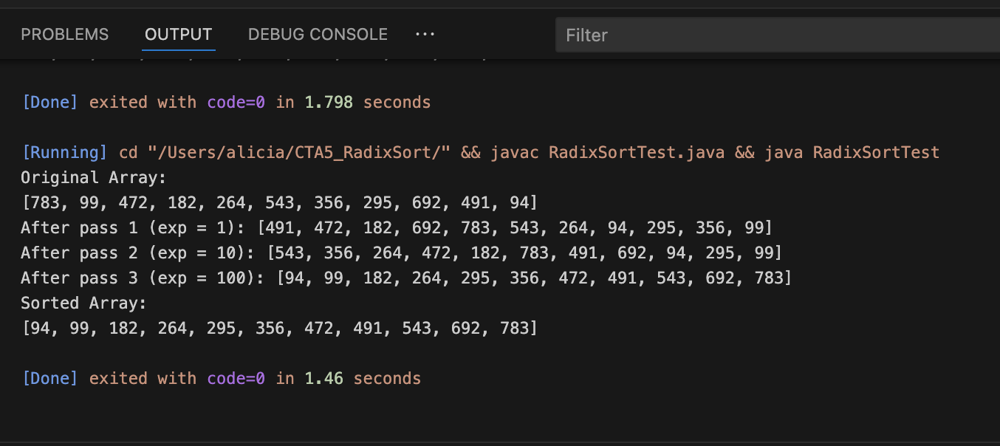

# CTA 5 – Radix Sort in Java

This project implements the **Radix Sort algorithm** in Java using `Integer[]` objects. It demonstrates how the array is sorted digit by digit (from least to most significant) and includes both the source code and output screenshots.

---

## Problem Statement

Sort the following array of `Integer` objects using **Radix Sort**:

[783, 99, 472, 182, 264, 543, 356, 295, 692, 491, 94]

---

## Algorithm Overview

**Radix Sort** is a non-comparative, digit-based sorting algorithm. It works by sorting the elements starting from the **least significant digit** to the **most significant digit**, using **Counting Sort** as a stable subroutine.

### Steps

1. Find the maximum number to determine the number of digits.
2. Perform Counting Sort for each digit place (units, tens, hundreds...).
3. Maintain stability to ensure correct ordering.

---

## Big-O Analysis

| Type             | Complexity         |
|------------------|--------------------|
| Time Complexity  | O(k × n), where `k` = number of digits in max element, and `n` = number of elements |
| Space Complexity | O(n + b), where `b` = base (10 for decimal) |

---

## How to Run the Code

Make sure you have Java installed, then run:

```bash
javac RadixSort.java RadixSortTest.java
java RadixSortTest
```

## Screenshot of Output


